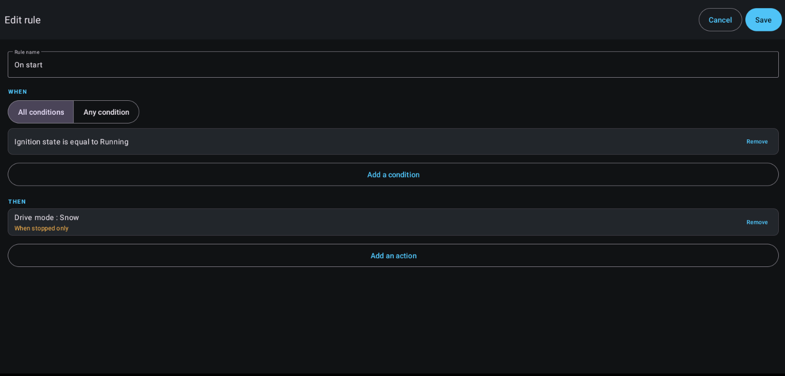

# MG4Tasker

<p align="center"></p>

[](../../actions/workflows/tests.yml)
[](../../actions/workflows/security.yml)
[](../../actions/workflows/release.yml)
[](LICENSE)

> ⚠️ **This app changes vehicle settings automatically and runs on a car.** Read
> [DISCLAIMER.md](DISCLAIMER.md) before installing. A rule is you delegating a setting
> change to happen without anyone touching the screen — write rules accordingly.

Rule-based automation for the MG4: **when** conditions are met at vehicle start, **then**
apply settings.

> If my partner's phone is connected, apply the "Comfort" profile and set the volume to 14.
> If it is below 5 °C on a weekday morning, turn on the seat heating.

MG4Tasker is **independent**. It reads and writes the vehicle directly through the shared
[MG4Hardware](https://github.com/malys/MG4Hardware) layer and works with **no MG4Control
installed**. MG4Control is optional: when present, one extra action — *apply an MG4Control
profile* — becomes available.

---

## Contents

- [Screenshots](#screenshots)
- [How it works](#how-it-works)
- [Requirements](#requirements)
- [MG4Control (optional)](#mg4control-optional)
- [The speed gate](#the-speed-gate)
- [Conditions and actions](#conditions-and-actions)
- [Firmware compatibility](#firmware-compatibility)
- [Climate and windows (read-only for now)](#climate-and-windows-read-only-for-now)
- [Diagnostic](#diagnostic)
  - [When a rule will not save](#when-a-rule-will-not-save)
- [Import and export (USB stick)](#import-and-export-usb-stick)
- [Building](#building)
- [Security](#security)

---

## Screenshots

<p align="center">
  
  
  
  
</p>
<p align="center">
  
</p>

---

## How it works

```
                    ┌──────────────────────────────────────┐
   Ignition ON  ──► │ MG4Tasker (system app)               │
                    │  own foreground service               │
                    │  1. reads the vehicle  ┐              │
                    │  2. evaluates rules    │ MG4Hardware  │
                    │  3. applies actions    ┘ (direct)     │
                    │     VehicleWriteGate → write / refuse │
                    │  4. logs the outcome                  │
                    └──────────────┬───────────────────────┘
                                   │ only for the "apply profile" action
                                   ▼
                    ┌──────────────────────────────────────┐
                    │ MG4Control (optional)                │
                    │  applyProfile(id) via TaskerBridge   │
                    └──────────────────────────────────────┘
```

MG4Tasker runs its **own** persistent service: it initialises MG4Hardware, listens for
ignition directly (no dependency on MG4Control), reads the vehicle and applies the rules'
actions through MG4Hardware. Started at boot and on app open.

**Trigger: ignition.** The "Test now" button replays the exact same path on demand, and a
master switch on the Rules screen disables automation without deleting rules.

---

## Requirements

- Signed with the ROM **platform key** and `sharedUserId="android.uid.system"` — the car
  permissions are `signature|privileged`, so this is what grants direct vehicle access (the
  same footing as MG4Control). The Diagnostic tab shows whether the vehicle layer came up.

That's it. MG4Control is **not** required.

---

## MG4Control (optional)

If [MG4Control](https://github.com/malys/MG4Control) is installed (and signed with the same
key), one extra action appears: **apply an MG4Control profile**. It reaches MG4Control's
`applyProfile` over the signature-protected bridge. It is the *only* MG4Control-dependent
capability; when MG4Control is absent the action is **not offered at all** — an action that
can only ever fail has no business in the picker — and everything else works.

> ⚠️ With both apps installed, **two apps can write the vehicle**. Each gates writes at
> 0 km/h independently, but a concurrent profile application and rule run can interleave
> multi-step ADAS writes. MG4Tasker warns once at start when it detects MG4Control.

---

## The speed gate

MG4Hardware refuses any write that changes road behaviour while the car is moving, or when
its speed is unreadable (*fail closed*) — the gate lives in the shared layer, so MG4Tasker
and MG4Control enforce the identical rule.

| | Speed-gated |
|---|---|
| Drive mode, regeneration, one-pedal, ADAS, AEB, ELK, ACC/TJA, limiter, whole profile | **Yes** — when stopped only |
| Seat and steering heating, volume, brightness, audio, notifications | No |

The editor shows "When stopped only" **at the moment you pick the action**, not after. When
an action is refused, the history gives the exact reason instead of staying silent.

`VEHICLE_POWER_OFF` is **deliberately absent** from the catalogue, and a unit test enforces
that no catalogue entry can reach it. Cutting the vehicle stays an explicit human gesture.

---

## Conditions and actions

An unreadable condition makes the rule **not evaluable** — it does not fire, and the
history names the missing signal. Unreadable is never treated as false.

Conditions span **context** (Bluetooth, time of day, day of week, firmware), **environment**
(outside temperature), **driving** (ignition, park, speed, drive mode, regeneration, energy
saving), **climate** (A/C, AUTO, recirculation, fan speed, set temperature, window open),
**comfort** (seat/steering heating, media volume, brightness), and **driver assistance**
(AEB, ELK, ACC/TJA, limiter, TSR, overspeed, speed-limit tone, ADAS sound).

Actions cover **profile** application, **driving**, **comfort**, **audio**, **driver
assistance**, and **system** (launch an app, show a notification, speak a message through
the head unit's text-to-speech engine). ADAS state — AEB, ELK,
ACC/TJA, TSR, overspeed and so on — is fully covered as gated actions.

The exact per-entry list and its firmware support is generated, not hand-written — see
below.

---

## Firmware compatibility

Every vehicle catalogue entry carries a `@SupportedOn(...)` annotation naming the firmware
generations it works on, derived from MG4Hardware's `FirmwareInfo` and per-generation
routing. That annotation is the single source of truth for three things:

1. **Self-documenting source** — the support set sits next to the entry.
2. **The compatibility matrix** — [docs/firmware-matrix.md](docs/firmware-matrix.md) is
   *generated* from the annotations by `FirmwareMatrix`, checked by a unit test. It is
   never edited by hand.
3. **The runtime filter** — the editor offers only the entries supported on the connected
   car's firmware (detected via MG4Hardware). One APK adapts to the car; there is no separate
   per-firmware build.

> The matrix is derived from MG4Hardware's code, **not** from on-vehicle testing. The app's
> Diagnostic tab is the source of truth for your own car: it reads each signal and shows
> "unreadable" where the firmware does not expose it.

Highlights (see the generated matrix for the full grid):

- **Seat / steering heating** — SWI133, SWI68, SWI165 only (the SWI69/131 trims lack the
  hardware).
- **ACC/TJA and speed limiter** — every generation except SWI133.
- **Overspeed alarm / speed-limit tone** — SWI133 and SWI132 only.
- **ADAS sound warning** — every generation except SWI133.
- **Lane-departure sound + vibration** — SWI132 only.
- **Fine audio** (Bose, balance, fader, tone, 3D, speed volume) — SWI133 and SWI132.

---

## Climate and windows (read-only for now)

Air conditioning (A/C, AUTO, recirculation, fan speed, set temperature) and window state
are available as **conditions** — read-only. They use standard AOSP HVAC/window property
ids that the R69 OEM sources expose, but which are **not yet verified on any MG4
generation**. MG4Hardware reads them null-safely; the Diagnostic tab shows whether each one
is actually readable on your car.

Climate/window **writes** are intentionally not in the catalogue. Adding them means a
verified property map first — writing a wrong id to the vehicle is exactly the risk being
deferred. Confirm the reads on the Diagnostic tab, and the write actions can follow.

---

## Diagnostic

The Diagnostic tab answers one question: **would a rule using this entry work on this car,
right now?** An entry marked OK is one the rule engine will not refuse.

That guarantee is kept by reusing the engine's own code rather than a parallel
implementation. A condition is called readable only when `ConditionEvaluator` — the object
the engine calls — returns something other than `UNAVAILABLE` on the same snapshot the cycle
would evaluate. An action is called runnable only after every check `DirectExecutor` performs
before it writes has passed: the firmware matrix, the 0 km/h standstill gate, a real bind to
MG4Control's bridge for the profile action, a speech engine for the spoken action, a live
notification channel for the notify action.

The one step it cannot take is the write itself — applying a drive mode to see whether it
sticks would change the car under the driver. So for vehicle writes, OK means "everything
checked before writing passes", and the history reports what the write did afterwards.

Three sections:

- **Execution context** — the prerequisites that decide whether rules run at all: vehicle
  layer, the ignition-listening service, the automation master switch, notifications, the
  standstill gate as it stands now, whether the cached supported-feature set is stale, and
  whether MG4Control is installed alongside.
- **Conditions** — the value read for each one, or why it cannot be read.
- **Actions** — runnable, or the exact check that blocks it.

An entry can read fine and still be marked *hidden in the editor*: the firmware matrix does
not list this generation, so the picker will not offer it, but an imported rule can still
reach it.

### Exporting the diagnostic and the logs

**Export**, on the Diagnostic tab and on the Console tab, writes one text file to storage:
the diagnostic verdicts, the current rules (in the import format, so they can be replayed on
another car), the run history, the in-app log and the last crash report.

The head unit has no cable, no logcat and no crash reporter, and the "Share" button needs an
app the car usually does not have. Writing `mg4tasker-diagnostic-<yyyyMMdd-HHmmss>.txt` to
the USB stick already used for rules is the path that works on the vehicle itself. The folder
is chosen with the same browser as the rules export, and the file is written to a `.tmp` then
renamed, so a stick pulled mid-write never leaves a half-report that reads as complete.

The report also carries a **Storage** section — every path `getExternalFilesDirs()` returns,
every root the browser offers, and where each one is actually writable. When an export cannot
reach a stick, that section is what says why.

### When a rule will not save

Saving reports which step failed instead of closing the editor as if it had worked. The store
writes with `commit()`, checks the return value, then **reads the rule back**; only a
successful read-back closes the editor. A quota refusal, a write the storage layer rejected,
and a write that committed but did not survive the read-back are different messages, and all
are written to the Console tab with the underlying exception.

That instrumentation found the actual cause, which was **release-only** and therefore invisible
on an emulator: `object : TypeToken<List<Rule>>() {}` needs its generic signature to survive
the shrinker, and R8 dropped the anonymous subclass outright — `-keepattributes Signature` and
`-keep class * extends TypeToken` did **not** prevent it. Every minified build threw
*"TypeToken must be created with a type argument"*, read back zero rules, and then persisted
that emptiness over the real ones on the next save. Both stores now deserialise with
`Array<T>::class.java`, a plain `Class` carrying no generics, so no keep rule can undo it;
`ShrinkerSafeGsonTest` fails the build if the idiom comes back. `RuleTransfer`'s DTOs are kept
explicitly for the same family of reason — their **field names are the JSON keys** written to
the stick, and R8 was free to rename them.

A read-modify-write is also never performed on top of a blob that failed to parse: save,
delete and enable/disable refuse rather than overwrite rules that are on disk and merely
unparsed. Import stays the deliberate way to replace the set.

---

## Import and export (USB stick)

**Export** and **Import** on the Rules screen move the whole rule set to and from a JSON
file — a backup before a reinstall, or the same rules on a second car, without retyping
anything on the on-screen keyboard.

**The app browses storage itself.** The MG4 head unit ships **no document picker** — the
Storage Access Framework answers *"FileManagement is not supported on this device"* — so there
is nothing to delegate to. Both buttons open a built-in browser instead: a chain of plain
dialogs, one per directory, sized for a one-finger tap on a car screen.

```
┌ Choose a rules file ─────────────┐   ┌ /storage/1A2B-3C4D ────────────┐
│ USB storage                      │   │ ⬆ Up one level                 │
│ /storage/1A2B-3C4D               │ → │ Android/                       │
│ Internal storage                 │   │ backup/                        │
│ /storage/emulated/0              │   │ mg4tasker-rules-20260727.json  │
└──────────────────── Cancel ──────┘   └──────────── Cancel ────────────┘
```

Release builds run as `android.uid.system` (see [`AndroidManifest.xml`](app/src/main/AndroidManifest.xml)),
which is what makes the **whole stick** browsable rather than only the app's own folder. On a
build without the platform signature the volume root is not listable, so the browser falls back
to `Android/data/com.mg4.tasker/files/` — readable on every build at every API level with no
storage permission. A single volume opens directly; several offer the list above.

**Finding the stick takes three sources, not one.** `getExternalFilesDirs()` alone is what an
emulator answers with, and it is why the stick was invisible on the car: the head unit mounts
it without registering it as an app-visible external volume, so the platform never reports it
and never creates an `Android/data` tree on it. The browser therefore also reads
`StorageManager`'s volume list, and finally scans the mount points the head unit actually uses
(`/storage/*`, `/mnt/media_rw/*`, `/mnt/usb*`, `/mnt/usbotg`, `/mnt/udisk`). Roots are
deduplicated by canonical path and any root that cannot be listed is dropped rather than
offered as a dead end. If the chosen folder refuses writes, the export falls back to the
app-specific folder **on that same volume**, so the file still lands on the stick the user
picked. The **Storage** section of the diagnostic report prints all of this, which is the way
to see what a given car actually exposes.

- **Export** asks for a folder ("Save here"), writes `mg4tasker-rules-<yyyyMMdd-HHmmss>.json`
  into it and shows the full path. The name is timestamped: an export is a backup, and
  overwriting the previous one loses it. The write is temp-file-then-rename, so a stick pulled
  mid-write leaves a `.tmp`, never a truncated rules file.
- **Import** lists directories plus `.json` files only, then **replaces the whole rule set**
  after a confirmation.

**Refusals are explicit.** A file off a USB stick is untrusted input, and an accepted file is
applied to a car — so a rules file is either taken whole or refused with the reason named
against the path the user picked:

| Refusal | Meaning |
|---|---|
| written by a newer version | `version` above the one this build understands |
| unknown condition or action | a catalogue entry this build cannot perform — never silently dropped |
| not a readable rules file | malformed, blank name, no condition, no action, duplicate ids, non-finite threshold, weekday outside 1–7 |
| more than 20 rules | above `RuleStore.MAX_RULES` |
| no rules | a valid envelope with an empty list |

Picking JSON that belongs to another app reports "not a readable rules file". Files over 256 KB
are refused on their length, before anything is read into memory.

**Format.** A versioned envelope, with enum values carried as their names:

```json
{
  "format": "mg4tasker-rules",
  "version": 1,
  "rules": [
    {
      "id": "1f2e…", "name": "Cold morning", "enabled": true, "match": "ALL",
      "conditions": [{ "type": "OUTSIDE_TEMP", "op": "LT", "number": 5.0 }],
      "actions":    [{ "type": "SET_STEERING_HEAT", "number": 2 }]
    }
  ]
}
```

Renaming a `ConditionType` / `ActionType` constant therefore invalidates older files — the
import reports the unknown entry rather than guessing.

---

## Installing on the MG4

The MG4 head unit has no visible way to open Settings or install an APK. The known route
in (via the on-screen keyboard) is:

1. Open any app with a text field and tap it to raise the on-screen keyboard — e.g. the
   Amazon Music app's email/login field.
2. **Long-press** the comma `,` (or the `@`) key on the keyboard.
3. Tap **"Language settings"**.
4. Tap the **search** icon in the top bar and type **`backup`**. It opens an empty page —
   now press the **back** arrow, and you land in Android's Settings panel.
5. Enable **Developer options**, and turn on **"Install unknown apps"** (unknown sources).
6. In Settings, search **`storage`** — you now have access to internal storage and the USB
   key. Navigate to the APK and tap it to install.

> ⚠️ You are enabling developer options and sideloading on a car. Do this **parked**, and
> only with an APK you trust. See [DISCLAIMER.md](DISCLAIMER.md).

## Building

```bash
mise install        # JDK 17 (AGP 9.1.1)
mise run test       # JVM unit tests (also regenerates docs/firmware-matrix.md)
mise run build      # debug APK
mise run check      # what CI runs
mise run release    # release APK (R8 on)
```

The Android SDK is shared with MG4Control: `mise run bootstrap` lives there.

To sign locally, in `gradle.properties` (never committed) or as environment variables:

```
mg4.keystore=/path/to/platform.keystore
mg4.keystore.password=…
mg4.key.alias=platform
mg4.key.password=…
```

### Layout

```
app/src/main/java/com/mg4/tasker/
  vehicle/   direct MG4Hardware access, executor, snapshot reader, profile bridge
  model/     Rule, Condition, Action, catalogues, @SupportedOn, FirmwareMatrix
  engine/    condition and rule evaluation — no Android dependency
  store/     JSON persistence of rules and history, rules file format, storage browsing
  ui/        list, generic editor, history, diagnostic, console, file browser
  service/   run cycle (foreground service)
  receiver/  ignition wake-up
  debug/     AppLogger ring buffer, CrashLogger, diagnostic verdicts + report export
```

The engine (`engine/`) imports nothing from Android: all decision behaviour — including
refusals and missing data — is testable on the JVM, with no vehicle.

### Adding a condition or action

One enum line in `ConditionType` or `ActionType`, one string, and — for a vehicle entry —
one `@SupportedOn(...)`. The editor builds itself from the `ValueSpec`; no screen to write.
For a vehicle action, add the matching branch to `DirectExecutor` (MG4Tasker writes the
vehicle directly through MG4Hardware, where the catalogue lives). The firmware matrix
regenerates on the next test run.

---

### Channels

Two build flavors, like the sibling apps:

- **stable** — tagged releases, **no self-update**. The updater class is not in the APK and
  it has no network permission.
- **unstable** — pre-releases published on every push to `master`, with **OTA**: the app
  checks GitHub pre-releases and downloads a newer unstable APK (https + GitHub host
  allowlist + same-signature check, all fail-closed; install is a manual tap). Installs
  beside stable as `com.mg4.tasker.unstable`.

```bash
mise run test            # both flavors
./gradlew assembleStableDebug assembleUnstableDebug
```

## Security

See [SECURITY.md](SECURITY.md) for reporting and scope. Three structural decisions:

1. **The speed gate lives in MG4Hardware.** MG4Tasker writes the vehicle directly, but the
   0 km/h gate is enforced in the shared write primitives — the same code MG4Control uses.
2. **The action catalogue is closed.** No arbitrary property write crosses the IPC contract.
3. **The optional MG4Control bridge is signature-protected.** MG4Control's exported
   `ProfileControlService` requires `com.mg4.control.permission.CONTROL_PROFILES`, at
   `protectionLevel="signature"` — only apps signed with the same platform key can bind.

See also [DISCLAIMER.md](DISCLAIMER.md) — this software runs on a vehicle.

## License

MIT — see [LICENSE](LICENSE) and [LICENSE.md](LICENSE.md).
