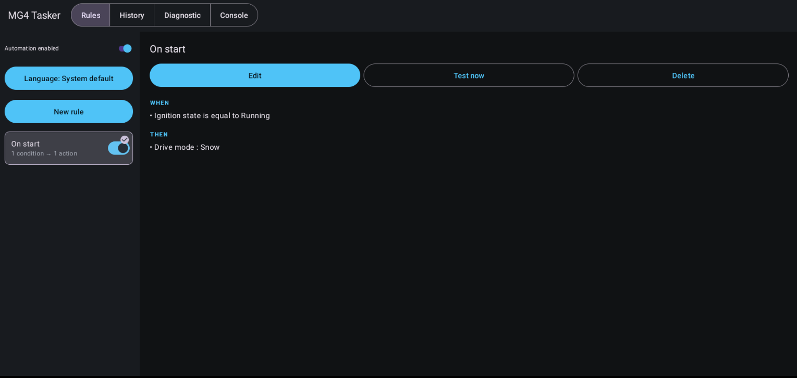
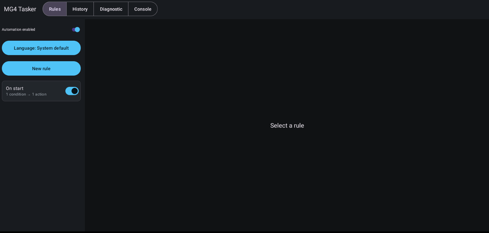
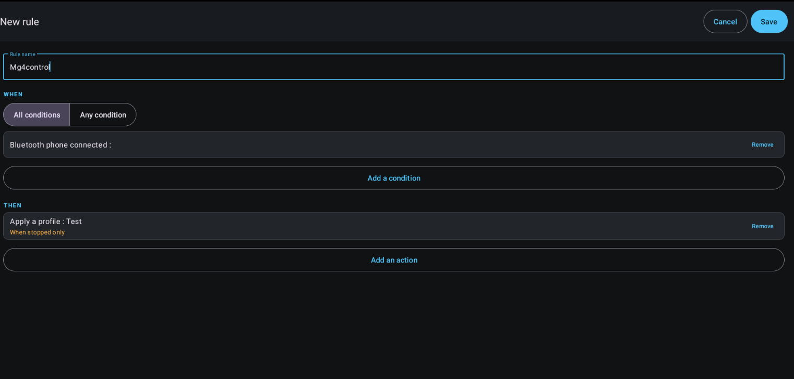
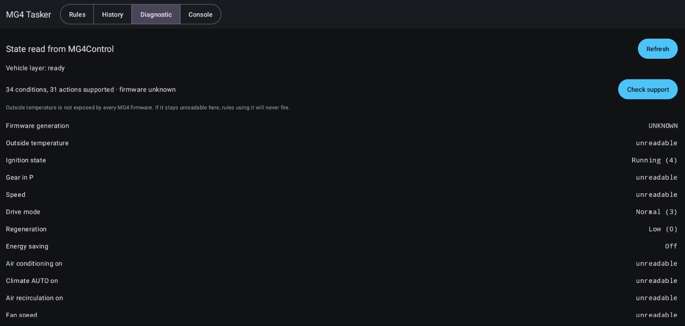

# EVTasker

<p align="center"></p>

[](https://github.com/malys/EVTasker/actions/workflows/tests.yml)
[](https://github.com/malys/EVTasker/actions/workflows/security.yml)
[](https://github.com/malys/EVTasker/actions/workflows/unstable.yml)
[](https://github.com/malys/EVTasker/releases)
[](LICENSE)

> ⚠️ **This app changes vehicle settings automatically and runs on a car.** Read
> [DISCLAIMER.md](DISCLAIMER.md) before installing. A rule is you delegating a setting
> change to happen without anyone touching the screen — write rules accordingly.
> MG and MG4 are third-party marks used only to identify compatibility; this independent
> project is not affiliated with or approved by SAIC Motor or MG Motor.

Rule-based automation for the MG4: **when** conditions are met at vehicle start, **then**
apply settings.

> If my partner's phone is connected, apply the "Comfort" profile and set the volume to 14.
> If it is below 5 °C on a weekday morning, turn on the seat heating.

EVTasker is **independent**. It reads and writes the vehicle directly through the shared
[EVHardware](https://github.com/malys/EVHardware) layer and works with **no EVProfile
installed**. EVProfile is optional: when present, one extra action — *apply an EVProfile
profile* — becomes available.

---

## Contents

- [Screenshots](#screenshots)
- [How it works](#how-it-works)
- [Requirements](#requirements)
- [EVProfile (optional)](#evprofile-optional)
- [The speed gate](#the-speed-gate)
- [Conditions and actions](#conditions-and-actions)
- [Cases: if, else if, else](#cases-if-else-if-else)
- [Firmware compatibility](#firmware-compatibility)
- [Vehicle services: climate, charging, radio, calls](#vehicle-services-climate-charging-radio-calls)
- [Diagnostic](#diagnostic)
- [Import and export (USB stick)](#import-and-export-usb-stick)
- [Install](#install)
- [Building](#building)
- [Project documents](#project-documents)
- [Security](#security)
- [Contributing](#contributing)
- [Legal](#legal)

## Screenshots
<p align="center">
  
  
  
  
</p>
<p align="center">
  
</p>

---

## How it works
```
                    ┌──────────────────────────────────────┐
   Ignition ON  ──► │ EVTasker (system app)               │
                    │  own foreground service               │
                    │  1. reads the vehicle  ┐              │
                    │  2. evaluates rules    │ EVHardware  │
                    │  3. applies actions    ┘ (direct)     │
                    │     VehicleWriteGate → write / refuse │
                    │  4. logs the outcome                  │
                    └──────────────┬───────────────────────┘
                                   │ only for the "apply profile" action
                                   ▼
                    ┌──────────────────────────────────────┐
                    │ EVProfile (optional)                │
                    │  applyProfile(id) via TaskerBridge   │
                    └──────────────────────────────────────┘
```

EVTasker runs its **own** persistent service: it initialises EVHardware, listens for
ignition directly (no dependency on EVProfile), reads the vehicle and applies the rules'
actions through EVHardware. Started at boot and on app open.

**Triggers: vehicle start, shift to P, and vehicle switch-off.** Shift to P fires only on a
confirmed non-P → P transition while the vehicle is running; starting the service while the
car is already parked does not fire it. Physical buttons are conditions, not another “Runs
at” choice: adding one makes that rule event-driven and hides the vehicle-trigger choice.
Button rules can choose short or long press on phone, center, directional/OK, source,
volume up/down, next/previous, mute, left star, right star, or assistant. Decoding and press-state handling live in the
shared EVHardware library.
A long press fires once and suppresses the following short-release event. The known right-button
codes (`286` and `18`) are both accepted for firmware compatibility; the assistant uses the
OEM voice keycode `287`. The SAIC broadcast is
accepted only from a signature-authorized sender because the action itself is not protected.

Each vehicle rule chooses one trigger; a rule written before triggers existed runs at start,
as it always did. The gear is sampled only while the ignition is in RUN because every supported
firmware exposes a synchronous P reading but not the same push callback. Switching off costs nothing extra —
the service already received every ignition transition and simply stopped reading at RUN, so
there is no second listener, no extra bind and no polling. At switch-off the car is powering
down: settings that persist (charge limit, locks) land, and anything the vehicle
drops with the ignition is reported by the history rather than assumed.

The "Test now" button replays the whole path on demand for the **selected rule only**, while
ignoring its vehicle trigger. A master switch on the Rules screen disables
automation without deleting rules.

---

## Requirements
- Signed with the ROM **platform key** and `sharedUserId="android.uid.system"` — the car
  permissions are `signature|privileged`, so this is what grants direct vehicle access (the
  same footing as EVProfile). The Diagnostic tab shows whether the vehicle layer came up.

That's it. EVProfile is **not** required.

---

## EVProfile (optional)
If [EVProfile](https://github.com/malys/EVProfile) is installed (and signed with the same
key), one extra action appears: **apply an EVProfile profile**. It reaches EVProfile's
`applyProfile` over the signature-protected bridge. It is the *only* EVProfile-dependent
capability; when EVProfile is absent the action is **not offered at all** — an action that
can only ever fail has no business in the picker — and everything else works.

> ⚠️ With both apps installed, **two apps can write the vehicle**. Each gates writes at
> 0 km/h independently, but a concurrent profile application and rule run can interleave
> multi-step ADAS writes. EVTasker warns once at start when it detects EVProfile.

---

## The speed gate
EVHardware refuses any write that changes road behaviour while the car is moving, or when
its speed is unreadable (*fail closed*) — the gate lives in the shared layer, so EVTasker
and EVProfile enforce the identical rule.

| | Speed-gated |
|---|---|
| Drive mode, regeneration, one-pedal, ADAS, AEB, ELK, ACC/TJA, limiter, whole profile | **Yes** |
| Seat and steering heating, volume, brightness, audio, climate, charging, radio, messages | No |

The editor shows "When stopped only" **at the moment you pick the action**, not after. When
an action is refused, the history gives the exact reason instead of staying silent.

### When the speed cannot be read at all

The action is refused. The threshold is fixed at exactly 0 km/h, cannot be raised, and no
secondary signal — including the gear position — can rescue an unreadable speed. The
Diagnostic tab reports this fixed policy and the current verdict.

### Refused because you were moving? The refusal is final

EVTasker does not retain or reapply a refused vehicle write at a later red light. A moving
or unreadable-speed refusal cancels that attempt. This prevents a setting from changing
after the moment and conditions that triggered the rule have passed.

Transient action failures are different: each failed action is retried independently up to
three times with exponential backoff (250 ms, then 500 ms). Actions that already succeeded
are never replayed.

A rule's actions run **one after the other, in the order shown in the editor**, and each one
is finished before the next starts. That order is part of the rule: the arrows on every
action row move it up or down. Where one write must land before the next is asked for —
switching the climate on, then setting the fan level — the **Wait** action (1 to 60 seconds)
holds the sequence in between. It touches nothing in the car, and appears in the history at
its place in the sequence. A rule made only of waits is refused at save time: it would hold
  the cycle and change nothing.

One cycle may spend **two minutes waiting in total**, every wait of every rule it evaluates
counted together — the rules of a cycle run one after the other, so a rule that waits also
delays the ones after it. Past that budget the wait is cut short and the history says so:
what follows would otherwise be applied against a snapshot taken before the driver left the
car. A single rule whose waits exceed the budget is refused at save time, so the limit is
learned in the editor rather than after the drive.

`VEHICLE_POWER_OFF` is **deliberately absent** from the catalogue, and a unit test enforces
that no catalogue entry can reach it. Cutting the vehicle stays an explicit human gesture.

---

## Conditions and actions
An unreadable condition makes the rule **not evaluable** — it does not fire, and the
history names the missing signal. Unreadable is never treated as false.

Conditions span **context** (Bluetooth, time of day, day of week, firmware, near a place,
the Wi-Fi network, media playing, a call in progress, how long the drive has lasted, a plain
chance in a hundred), **environment** (outside temperature, the weather where the car is),
**driving** (ignition, park, speed, odometer, drive mode,
regeneration, energy saving), **energy** (battery level, charging, charging state, charge
limit, remaining range, scheduled charging and the two ends of its window, battery
pre-heating), **climate**
(climate on, A/C, AUTO, ECON, recirculation, fan speed, driver and passenger target
temperatures, both defrosters, window open, and each of the four windows on its own),
**comfort** (seat/steering heating, media volume,
brightness), and **driver assistance** (AEB, ELK, ACC/TJA, limiter, TSR, overspeed,
speed-limit tone, ADAS sound).

**Charging** and **charging state** are not the same question. The first is a flag — current
is flowing — and it is what a rule pre-heating the cabin on a charger wants. The second is
the state itself, and it is the only one that can say *plugged in and not charging*, which is
what a rule warning a driver about to walk away is about.

Three Bluetooth conditions, and the difference between them is the whole point. **Phone
connected** is a radio fact: it is true of a phone left indoors while the car is parked in
front of the house, which is what made arrival rules fire on the driveway. **Phone on
board** is only true of a device still connected once the car has actually driven, so a
phone that stayed behind drops out of it — at the cost of being unreadable, and therefore
unevaluable, until the first few hundred metres. **Hands-free phone** is the one the head
unit chose to route calls through: available from the first second, and the way to tell two
phones apart when both are in range. A rule that must act at ignition should use *phone
connected* together with a vehicle signal (ignition, speed, not in park) instead.

Actions cover **profile** application, **driving**, **comfort**, **climate** (on/off, driver
and passenger target temperatures, A/C, ECON, AUTO, recirculation, fan level, front and rear
defrosters), **energy**
(charge limit, allow charging, scheduled charging and its window, battery pre-heating),
**audio** (volume, the fine controls, the radio — play, silence, toggle, tune, station stepping, screen), **driver assistance**, and **system**
(launch an app, show a message, speak through the head unit's text-to-speech engine,
navigate to a destination, call a number, media play/pause and track skip, Bluetooth and
Wi-Fi on or off, enable or disable another rule, wait). ADAS state — AEB, ELK, ACC/TJA, TSR, overspeed and
so on — is fully covered as gated actions.

**The glass can be read but not moved, so the window actions are not offered.** The car
reports where each window is as a percentage — the four readings are conditions like any
other and work — but the service that moves them accepts a command in **0..7** on the way in
and silently discards anything larger, and what each of the eight commands does is documented
nowhere on the firmware. No application on the head unit sends one, so there is no example to
read the mapping off. A write is therefore accepted and dropped: success in the history, glass
that has not moved. Rather than let the app promise that, the five window actions are marked
as having no established effect: the Diagnostic screen blocks them ("effect never confirmed on
this car"), the rule editor does not list them, and a rule imported from elsewhere that still
names one is refused instead of retried.

**Your car can settle it, and then they work.** The Diagnostic screen's *Probe the windows*
sends each of the eight commands to the driver's window and reads the position back between
each, which is the one thing that establishes what they do. It asks first and says what to
check before the glass starts moving on its own — no hand on the window, no animal, no child,
no rain — refuses to start unless the car is stopped with the ignition on, re-checks that
before **every** command, and closes the window again afterwards or tells you it could not.
What it observes unlocks the five window actions on that car alone, is forgotten when the
firmware generation changes, and never leaves the head unit. A probe that finds nothing leaves
the actions where they were, which is the honest answer rather than a failure.

**The weather** is the head unit's own, asked for where the car is — no account, no API key,
no traffic of ours. Current conditions only: the map service answers nothing about later
today or tomorrow, and the weather application's own outlook is fetched with credentials no
other app can reach. It is matched as a fragment, so "rain" catches "Light rain" and "Rain
showers", and the phrase comes back in the head unit's language: on a French car the rule
asks about "pluie". A car whose head unit has no weather service leaves the condition
unreadable, which stops the rule rather than guessing at the sky.

**Trip distance is deliberately absent.** The head unit's navigation adapter only receives
the remaining distance as a stream of callbacks from whichever navigation app is running, so
reading it would mean holding a subscription for the life of the app. The **odometer** is a
plain reading and is what a "service due" rule actually wants.

**Enabling and disabling rules** is what lets rules become chains. A rule that should only
apply during a trip is one rule switching a second on at departure and off on arrival — no
stored state, nothing new to evaluate. The change lands for the *next* trigger, not the
current pass: a rule that could enable another and have it fire in the same cycle would make
the order of that cycle part of what the user has to reason about. A rule may switch itself
off, which is how "run once" is written; the switch in the rule list always puts it back.

**Near a place** compares the car's last known fix with a point stored in the rule and a
radius in metres. The point is prefilled with where the car is when the condition is created,
because nobody types coordinates on a head unit. No fix means the condition is *unavailable*,
not "somewhere else" — otherwise every "when I am NOT at home" rule would fire on the
driveway while the GPS was still acquiring. The coordinates never leave the car.

Value controls open on **what the car reports right now** — the brightness slider starts where
the screen already is, not at 5%. Reopening a saved action shows what the rule says instead,
so editing a rule cannot quietly rewrite it.

The exact per-entry list and its firmware support is generated, not hand-written — see
below.

---

## Cases: if, else if, else
A rule can carry several cases. They are tried in the order they are written and **exactly
one of them runs**: the first whose conditions hold wins, and the "else" is what happens when
none did.

```
IF    outside temperature < 5 °C      → steering heating 2, seat heating 2
ELSE IF  outside temperature < 18 °C  → fan level 1
ELSE                                  → media volume 12
```

Without cases, that is three rules whose conditions have to exclude each other by hand, and
the day one range is edited the three stop agreeing. The "else" is optional: a rule that says
nothing about the remaining situations simply does nothing in them.

**An unreadable reading stops the rule where it stands.** It does not fall through to the next
case, and it does not reach the "else". Unreadable is not false — falling through would mean
writing to the vehicle *because* a value was missing, which is the one thing the engine never
does. The history reports the rule as not evaluable and names the missing signal, exactly as
it does for a rule with a single case.

**Each case is edited in its own window**, opened from its card on the rule screen: what is
checked on the left, what is done on the right, each list with its own scroll and its own
"add" button. The rule screen itself keeps the shape of the rule — the cases in the order they
are tried, each with the size of what it checks and of what it does — and the order of the
"else if" cases is changed with the arrows on their cards. A rule takes at most four "else if"
cases: past that the chain stops being readable at a glance on a screen at arm's length.

The history names the case that ran ("applied — ELSE IF 1"), because "applied" alone leaves
the one question a branched rule raises after the fact unanswered.

**A rule that names a physical button must name one in every case, and takes no "else".** A
button condition does not only test something — it decides which event stream brings the rule
its cycles, for the whole rule. A case that named no button would be evaluated on presses of
buttons it never mentioned, and an "else", which tests nothing at all, would run on every
press of every button. Refused at save and at import rather than silently rewired.

The wait budget compares the **longest** case, not the sum of them: only one case runs, so
adding them up would refuse a rule that can never wait that long.

---

## Firmware compatibility
Every vehicle catalogue entry carries a `@SupportedOn(...)` annotation naming the firmware
generations it works on, derived from EVHardware's `FirmwareInfo` and per-generation
routing. That annotation is the single source of truth for three things:

1. **Self-documenting source** — the support set sits next to the entry.
2. **The compatibility matrix** — [EVHardware/docs/firmware-matrix.md](EVHardware/docs/firmware-matrix.md) is
   *generated* from the annotations by `FirmwareMatrix`, checked by a unit test. It is
   never edited by hand.
3. **The runtime filter** — the editor offers only the entries supported on the connected
   car's firmware (detected via EVHardware). One APK adapts to the car; there is no separate
   per-firmware build.

> The matrix is derived from EVHardware's code, **not** from on-vehicle testing. The app's
> Diagnostic tab is the source of truth for your own car: it reads each signal and shows
> "unreadable" where the firmware does not expose it.

**When the generation cannot be identified, the editor still offers everything and execution
refuses.** Hiding entries on a guess would leave a car unable to write rules it can perfectly
well run, so the picker filters nothing without a positive match. A vehicle action, on the
other hand, is only attempted on a generation its annotation actually names: anything else is
reported as `firmware support not confirmed` in the history rather than written to a car we
could not identify. The Diagnostic tab reports the same verdict, because it runs the same
check.

Highlights (see the generated matrix for the full grid):

- **Seat / steering heating** — SWI133, SWI68, SWI165 only (the SWI69/131 trims lack the
  hardware).
- **ACC/TJA and speed limiter** — every generation except SWI133.
- **Overspeed alarm / speed-limit tone** — SWI133 and SWI132 only.
- **ADAS sound warning** — every generation except SWI133.
- **Lane-departure sound + vibration** — SWI132 only.
- **Fine audio** (Bose, balance, fader, tone, 3D, speed volume) — SWI69, SWI131, SWI132: the
  SAIC `caradapter` audio helper these go through is bound on the A9 platform only.
- **Climate, charging, radio and calls** — SWI68 and SWI165. They run on SAIC vendor services rather than on
  property ids, and whether a given car answers is a bind, not a table: the Diagnostic tab's
  *Vehicle services* row reports which of the four responded, and the matrix widens once a
  car outside that set reports one.

---

## Vehicle services: climate, charging, radio, calls
Climate and charging used to be read-only and unverified — standard AOSP property ids the
that no MG4 confirmed. Writing one of those would have been a guess, so
there were no write actions.

They now go through the **SAIC vendor services** instead: the same binder interfaces the
car's own HVAC, charging, radio and hands-free apps use. One bound service
(`com.saicmotor.service.vehicle`) exposes a hub
that hands out `aircondition`, `vehiclecharging`, `vehiclecontrol` and `vehiclecondition`;
radio and telephony are their own services. What those calls do is not in doubt — they are what the car does to itself.

That buys four things the property ids could not:

- **Climate writes** — on/off, target temperature (17–33 °C, the ends being LO and HI as in
  the stock UI), A/C, AUTO, recirculation, fan level, front and rear defrosters.
- **Battery and charging** — charge limit in percent, allow/deny charging, the scheduled
  charging window, and battery pre-heating.
- **Radio** — resume the last station, silence it, toggle between the two, tune a station,
  step through the tuner's own list, or open the radio screen. All of them name the *tuner*,
  which is what separates them from the media play/pause below: that one follows whichever
  source owns the audio, so it stops Bluetooth when Bluetooth is the one playing.
  The frequency is typed the way a driver says it — `103.5`, `FM 103,5`, `1080 AM` all land —
  and text naming no station is reported as that rather than tuned to something near it.
  The toggle reads the tuner's own play state and, when the car will not report it, sends
  nothing and says so: a wheel button can be pressed twice, a rule that fires while you are
  driving cannot, and a guessed direction is a car left silent or left playing.
  Opening the radio screen is the only one of them that takes the standstill gate — the rest
  change what you hear, that one changes what is in front of you.
  **DAB** cannot be tuned by frequency, because a DAB service is addressed by ensemble and
  service id and there is nothing for a driver to type; next and previous station reach it,
  which is the same call the car's own launcher makes. Every candidate that was considered
  and refused is written down in EVHardware's `docs/radio-action-gap.md`.
- **Calls** — placed by the car's hands-free stack on the paired phone. The head unit has no
  SIM and no dialer, so `ACTION_CALL` would find nothing to handle it.
  A rule can store a typed number or select a name/number from the phone book explicitly
  shared over Bluetooth PBAP. Contact access is requested only while configuring that action;
  execution uses the stored number and does not need the phone book to remain available.
- **Text messages** — same recipient field as a call, one Bluetooth profile further out. The
  vendor hands-free service has no message transaction, so the message is handed to the
  **Message Access Profile** in its client role — the profile the car's own Bluetooth settings
  manage as "MAP Client" — and the *paired phone* sends it. That needs the phone to share its
  messages over MAP and to allow sending; a phone that only shares calls and contacts, and an
  iPhone, answer nothing here. The Diagnostic tab's *Text messages* row names the phone that
  would carry it, or says there is none. Nothing is ever retried: a send that failed may still
  have left the phone, and the same message going out twice is worse than not going out.

Climate **conditions** now read from the same service where it answers, falling back to the
AOSP ids elsewhere — so what a rule tests and what an action writes are the same signal.

Window **writes** stay unavailable: the service takes them, but as a command whose meaning
nothing on the firmware establishes — see the glass paragraph above.

Navigation is the exception with no vendor API — `NAVIGATE_TO` uses the standard `geo:`
intent, then `google.navigation:`, and reports honestly when the head unit has neither.
Its destination can be either `latitude,longitude` or a place name/address. HTTPS webhooks
are available as GET and POST actions; POST accepts an optional JSON body.

Both the **near a place** condition and the **Navigate to** action take their point the same
way: type it, take the car's current position, open the map, or pick a **saved place**. Saved
places are EVTasker's own list — the head unit's navigation app exposes no provider and no
intent for its favourites — and are named from the editor, from whatever point is in the
field. The location condition opens on the car's current position, because the place a rule
is about is usually the place it is written at; the destination does not, because that is the
one place a rule never navigates to.

**Ask for confirmation** is the one action whose answer decides the rest of the rule. It
shows its question full-screen and runs the actions after it only on "yes". Anything else —
"no", leaving the screen, or silence until the countdown runs out — stops the branch where it
stands, and the history shows the rule as *skipped* rather than failed. The wait is part of
the action: 5 to 60 seconds, 10 by default, because a question asked before the doors unlock
is answered at once while one asked at the end of a drive has to survive the driver looking
away. Actions that never ran get no history line, since there is no verdict to report for
them. One prompt at a time: a second rule asking while one is open is refused its answer
rather than given someone else's.

---

## Diagnostic
The Diagnostic tab answers one question: **would a rule using this entry work on this car,
right now?** An entry marked OK is one the rule engine will not refuse.

That guarantee is kept by reusing the engine's own code rather than a parallel
implementation. A condition is called readable only when `ConditionEvaluator` — the object
the engine calls — returns something other than `UNAVAILABLE` on the same snapshot the cycle
would evaluate. An action is called runnable only after every check `DirectExecutor` performs
before it writes has passed: the firmware matrix, the 0 km/h standstill gate, a real bind to
EVProfile's bridge for the profile action, a speech engine for the spoken action, a live
notification channel for the notify action.

The one step it cannot take is the write itself — applying a drive mode to see whether it
sticks would change the car under the driver. So for vehicle writes, OK means "everything
checked before writing passes", and the history reports what the write did afterwards.

**The first launch after an upgrade opens on this tab**, because a new build's verdicts about
this car are what changed. The marker is written by the main screen, never by a background
receiver: a package replacement must not put an activity in front of a driver who is moving.

Three sections:

- **Execution context** — the prerequisites that decide whether rules run at all: vehicle
  layer, the ignition-listening service, the automation master switch, notifications, the
  standstill gate as it stands now, whether the cached supported-feature set is stale,
  whether EVProfile is installed alongside, which speech engine the car exposes, and which
  Bluetooth devices are connected right now. The last one is listed by MAC on purpose:
  comparing it with the address a rule names is what turns "my Bluetooth rule never fires"
  into an answer.
- **Conditions** — the value read for each one, or why it cannot be read.
- **Actions** — runnable, or the exact check that blocks it.

An entry can read fine and still be marked *hidden in the editor*: the firmware matrix does
not list this generation, so the picker will not offer it, but an imported rule can still
reach it.

### Testing a rule

**Test now** on the Rules screen runs one full cycle — the exact ignition path, so a passing
test proves the real thing — and then **shows what it decided** for that rule: its
outcome (applied, conditions not met, cannot be evaluated, failed), the per-action verdict
behind a failure, and the name of any signal that could not be read. It used to say "test
running" and stop there, which answers nothing for a button whose whole purpose is to answer
that question.

### Exporting the diagnostic and the logs

**Export**, on the Diagnostic tab and on the Console tab, writes one text file to storage:
the diagnostic verdicts, the current rules (in the import format, so they can be replayed on
another car), the run history, the in-app log and the last crash report.

The head unit has no cable, no logcat and no crash reporter. Writing
`evtasker-diagnostic-<yyyyMMdd-HHmmss>.txt` to
the USB stick already used for rules is the path that works on the vehicle itself. The folder
is chosen with the same browser as the rules export, and the file is written to a `.tmp` then
renamed, so a stick pulled mid-write never leaves a half-report that reads as complete.

The report also carries a **Storage** section — every path `getExternalFilesDirs()` returns,
every root the browser offers, and where each one is actually writable. When an export cannot
reach a stick, that section is what says why.

### Sharing the logs from the car

**Share**, on the Console tab, uploads the same report — as Markdown — to a
[PrivateBin](https://privatebin.info/) paste on [paste.chapril.org](https://paste.chapril.org),
run by the French non-profit April. It exists because a USB stick is not always at hand, and
because the car has no share target worth the name.

- **Encrypted on the device.** PrivateBin is zero-knowledge: the key never reaches the
  server, it travels only in the URL fragment. The paste is additionally protected by the
  password `evtaskerR0ck$`.
- **Gone in an hour.** The expiry is set to `1hour`, short enough that a car's diagnostic is
  not left lying around.
- **Confirmed every time.** A dialog names the host before anything leaves the vehicle.
  Nothing is ever uploaded in the background.
- **The link comes back through the log.** A toast cannot be read after it fades and the
  head unit has no clipboard worth using, so the paste URL and the password are written to
  the in-app log — the screen the user is already on, and one that survives into the next
  exported report.
- **The paste says how to read it.** Its first block, in the app's language, gives the
  password, the expiry, and credit to [April](https://www.april.org) — who run the instance
  free of charge — with a donation link. Whoever receives the link needs none of that
  explained to them separately.

Read it back by opening the link and entering the password. The upload is the only network
use of the stable build.

### When a rule will not save

Saving reports which step failed instead of closing the editor as if it had worked. The store
writes with `commit()`, checks the return value, then **reads the rule back**; only a
successful read-back closes the editor. A quota refusal, a write the storage layer rejected,
and a write that committed but did not survive the read-back are different messages, and all
are written to the Console tab with the underlying exception.

That instrumentation found the actual cause, which was **release-only** and therefore invisible
on an emulator: `object : TypeToken<List<Rule>>() {}` needs its generic signature to survive
the shrinker, and R8 dropped the anonymous subclass outright — `-keepattributes Signature` and
`-keep class * extends TypeToken` did **not** prevent it. Every minified build threw
*"TypeToken must be created with a type argument"*, read back zero rules, and then persisted
that emptiness over the real ones on the next save. Both stores now deserialise with
`Array<T>::class.java`, a plain `Class` carrying no generics, so no keep rule can undo it;
`ShrinkerSafeGsonTest` fails the build if the idiom comes back. `RuleTransfer`'s DTOs are kept
explicitly for the same family of reason — their **field names are the JSON keys** written to
the stick, and R8 was free to rename them.

A read-modify-write is also never performed on top of a blob that failed to parse: save,
delete and enable/disable refuse rather than overwrite rules that are on disk and merely
unparsed. Import stays the deliberate way to replace the set.

---

## Import and export (USB stick)
**Export** and **Import**, on the Configuration tab, move the whole rule set to and from a JSON
file — a backup before a reinstall, or the same rules on a second car, without retyping
anything on the on-screen keyboard.

**The app browses storage itself.** The MG4 head unit ships **no document picker** — the
Storage Access Framework answers *"FileManagement is not supported on this device"* — so there
is nothing to delegate to. Both buttons open a built-in browser instead: a chain of plain
dialogs, one per directory, sized for a one-finger tap on a car screen.

```
┌ Choose a rules file ─────────────┐   ┌ /storage/1A2B-3C4D ────────────┐
│ USB storage                      │   │ ⬆ Up one level                 │
│ /storage/1A2B-3C4D               │ → │ Android/                       │
│ Internal storage                 │   │ backup/                        │
│ /storage/emulated/0              │   │ evtasker-rules-20260727.json  │
└──────────────────── Cancel ──────┘   └──────────── Cancel ────────────┘
```

Release builds run as `android.uid.system` (see [`AndroidManifest.xml`](app/src/main/AndroidManifest.xml)),
which is what makes the **whole stick** browsable rather than only the app's own folder. On a
build without the platform signature the volume root is not listable, so the browser falls back
to `Android/data/com.evsuite.tasker/files/` — readable on every build at every API level with no
storage permission. A single volume opens directly; several offer the list above.

**Finding the stick takes three sources, not one.** `getExternalFilesDirs()` alone is what an
emulator answers with, and it is why the stick was invisible on the car: the head unit mounts
it without registering it as an app-visible external volume, so the platform never reports it
and never creates an `Android/data` tree on it. The browser therefore also reads
`StorageManager`'s volume list, and finally scans the mount points the head unit actually uses
(`/storage/*`, `/mnt/media_rw/*`, `/mnt/usb*`, `/mnt/usbotg`, `/mnt/udisk`). Roots are
deduplicated by canonical path and any root that cannot be listed is dropped rather than
offered as a dead end. If the chosen folder refuses writes, the export falls back to the
app-specific folder **on that same volume**, so the file still lands on the stick the user
picked. The **Storage** section of the diagnostic report prints all of this, which is the way
to see what a given car actually exposes.

- **Export** asks for a folder ("Save here"), writes `evtasker-rules-<yyyyMMdd-HHmmss>.json`
  into it and shows the full path. The name is timestamped: an export is a backup, and
  overwriting the previous one loses it. The write is temp-file-then-rename, so a stick pulled
  mid-write leaves a `.tmp`, never a truncated rules file.
- **Import** lists directories plus `.json` files only, then **replaces the whole rule set**
  after a confirmation.

**Refusals are explicit.** A file off a USB stick is untrusted input, and an accepted file is
applied to a car — so a rules file is either taken whole or refused with the reason named
against the path the user picked:

| Refusal | Meaning |
|---|---|
| written by a newer version | `version` above the one this build understands |
| unknown condition or action | a catalogue entry this build cannot perform — never silently dropped |
| not a readable rules file | malformed, blank name, no condition, no action, duplicate ids, non-finite threshold, weekday outside 1–7, a case with no condition or no action, a button rule whose cases do not all name a button, cases in a file claiming version 1 |
| more than 20 rules | above `RuleStore.MAX_RULES`, or a rule with more than four "else if" cases |
| no rules | a valid envelope with an empty list |

Picking JSON that belongs to another app reports "not a readable rules file". Files over 256 KB
are refused on their length, before anything is read into memory.

**Format.** A versioned envelope, with enum values carried as their names:

```json
{
  "format": "evtasker-rules",
  "version": 2,
  "rules": [
    {
      "id": "1f2e…", "name": "Cold morning", "enabled": true, "match": "ALL",
      "conditions": [{ "type": "OUTSIDE_TEMP", "op": "LT", "number": 5.0 }],
      "actions":    [{ "type": "SET_STEERING_HEAT", "number": 2 }],
      "elseIf": [
        {
          "match": "ALL",
          "conditions": [{ "type": "OUTSIDE_TEMP", "op": "LT", "number": 18.0 }],
          "actions":    [{ "type": "SET_FAN_LEVEL", "number": 1 }]
        }
      ],
      "elseActions": [{ "type": "SET_MEDIA_VOLUME", "number": 12 }]
    }
  ]
}
```

`elseIf` and `elseActions` arrived with version 2 and are **absent** from a rule that has no
other case — so a file whose rules are all plain if/then still says `"version": 1` and stays
readable by a build that predates cases. A file that does carry one says 2, and an older build
refuses it whole rather than applying its first case alone.

Renaming a `ConditionType` / `ActionType` constant therefore invalidates older files — the
import reports the unknown entry rather than guessing.

An import-ready [example rule set](examples/useful-rules.json) contains four broadly useful
starting points. They are disabled on import so each driver can review the values before
enabling them. Exports from the former MG4Tasker name (`mg4tasker-rules`) remain accepted;
new exports always use `evtasker-rules`.

---

## Install
The MG4 head unit has no visible way to open Settings or install an APK. The known route
in (via the on-screen keyboard) is:

1. Open any app with a text field and tap it to raise the on-screen keyboard — e.g. the
   Amazon Music app's email/login field.
2. **Long-press** the comma `,` (or the `@`) key on the keyboard.
3. Tap **"Language settings"**.
4. Tap the **search** icon in the top bar and type **`backup`**. It opens an empty page —
   now press the **back** arrow, and you land in Android's Settings panel.
5. Enable **Developer options**, and turn on **"Install unknown apps"** (unknown sources).
6. In Settings, search **`storage`** — you now have access to internal storage and the USB
   key. Navigate to the APK and tap it to install.

> ⚠️ You are enabling developer options and sideloading on a car. Do this **parked**, and
> only with an APK you trust. See [DISCLAIMER.md](DISCLAIMER.md).

## Building
```bash
mise install        # JDK 17 (AGP 9.1.1)
mise run test       # JVM unit tests (also regenerates docs/firmware-matrix.md)
mise run build      # debug APK
mise run check      # what CI runs
mise run release    # release APK (R8 on)
```

The Android SDK is shared with EVProfile: `mise run bootstrap` lives there.

To sign locally, in `gradle.properties` (never committed) or as environment variables:

```
evsuite.keystore=/path/to/platform.keystore
evsuite.keystore.password=…
evsuite.key.alias=platform
evsuite.key.password=…
```

### Layout

```
app/src/main/java/com/evsuite/tasker/
  vehicle/   direct EVHardware access, executor, snapshot reader, profile bridge
  model/     Rule, Condition, Action, catalogues, @SupportedOn, FirmwareMatrix
  engine/    condition and rule evaluation — no Android dependency
  store/     JSON persistence of rules and history, rules file format, storage browsing
  ui/        list, generic editor, configuration, history, diagnostic, console, file browser
  service/   run cycle (foreground service)
  receiver/  ignition wake-up
  debug/     AppLogger ring buffer, CrashLogger, diagnostic verdicts + report export
```

The engine (`engine/`) imports nothing from Android: all decision behaviour — including
refusals and missing data — is testable on the JVM, with no vehicle.

### Adding a condition or action

One enum line in `ConditionType` or `ActionType`, one string, and — for a vehicle entry —
one `@SupportedOn(...)`. The editor builds itself from the `ValueSpec`; no screen to write.
For a vehicle action, add the matching branch to `DirectExecutor` (EVTasker writes the
vehicle directly through EVHardware, where the catalogue lives). The firmware matrix
regenerates on the next test run.

---

### Channels

Two build flavors, like the sibling apps:

- **stable** — tagged releases, **no self-update**. The updater class is not in the APK.
  It does carry `INTERNET`, because the webhook action is written on the channel people
  drive; nothing uses it unless a rule fires or the user confirms a Console share.
- **unstable** — pre-releases published on every push to `master`. Its OTA trigger is
  **suspended during the suite safety and legal audit**; updates are manual. The isolated
  updater policy remains covered by tests for a possible reviewed reactivation. Installs
  beside stable as `com.evsuite.tasker.unstable`.

The Console tab is always visible on unstable builds. On the stable channel it is
hidden from the normal navigation and appears after three taps on the Diagnostic tab.

```bash
mise run test            # both flavors
./gradlew assembleStableDebug assembleUnstableDebug
```

## Project documents
| Document | What it covers |
|---|---|
| [DESIGN.md](DESIGN.md) | The EVSuite design system — colour, type, touch targets, icons |
| [AGENTS.md](AGENTS.md) | Context for AI agents working in this repository |
| [CONTRIBUTING.md](CONTRIBUTING.md) | How to build, test and submit a change |
| [SECURITY.md](SECURITY.md) | Threat model and vulnerability disclosure |
| [DISCLAIMER.md](DISCLAIMER.md) | Vehicle-safety disclaimer — read before installing |
| [CHANGELOG.md](CHANGELOG.md) | Release history |
| [LICENSE.md](LICENSE.md) | Licence text |

## Security
See [SECURITY.md](SECURITY.md) for reporting and scope. Three structural decisions:

1. **The speed gate lives in EVHardware.** EVTasker writes the vehicle directly, but the
   0 km/h gate is enforced in the shared write primitives — the same code EVProfile uses.
2. **The action catalogue is closed.** No arbitrary property write crosses the IPC contract.
3. **The optional EVProfile bridge is signature-protected.** EVProfile's exported
   `ProfileControlService` requires `com.evsuite.profile.permission.CONTROL_PROFILES`, at
   `protectionLevel="signature"` — only apps signed with the same platform key can bind.

See also [DISCLAIMER.md](DISCLAIMER.md) — this software runs on a vehicle.

## Contributing
Read [CONTRIBUTING.md](CONTRIBUTING.md) before opening a pull request. In short: this
code runs in a moving vehicle, so changes stay small, carry tests, and say in the diff
what would break without them. Anything touching the interface follows
[DESIGN.md](DESIGN.md).

## Legal
MIT — see [LICENSE](LICENSE) and [LICENSE.md](LICENSE.md).
